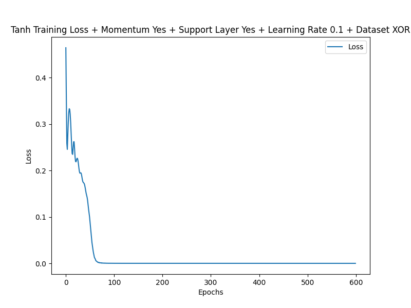

# Backpropagation Algorithm

## Overview

This project implements the backpropagation algorithm to train a neural network. Backpropagation is a supervised learning algorithm used to minimize a loss function by updating the weights and biases of the network. The algorithm is validated by training a neural network to solve binary classification tasks, including XOR, AND, and OR gates.

The goal is to achieve accurate classification for all tasks while evaluating the impact of different configurations on training performance.

<div align="center">
  
</div>

---

## Task

The task involves implementing a modular backpropagation algorithm using NumPy. The following steps are implemented:

- **Model Architecture**:
  - Linear layers for weighted sums.
  - Non-linear activation layers (Sigmoid, Tanh, ReLU).
  - Optional support layers for deeper architectures.

- **Training**:
  - Train using the XOR, AND, and OR datasets.
  - Evaluate the effects of learning rate, momentum, and support layers.

- **Evaluation**:
  - Measure training loss across epochs.
  - Visualize training trends and model performance.

---

## How to Run

1. **Clone the Repository**:

```bash
git clone https://github.com/admtrv/Backpropagation.git
```

2. **Run the Main Script**:

Train and evaluate the model by running:
```bash
python backpropagation.py
```

3. **Adjust Parameters**:

Modify `config.py` to adjust settings like:
- Dataset (`xor`, `and`, or `or`)
- Activation function (`sigmoid`, `tanh`, or `relu`)
- Learning rate, momentum, and number of epochs.

---

## Dependencies

This project requires the following Python libraries:

- `numpy` for numerical computations.
- `matplotlib` for plotting loss trends.

Install dependencies with:
```bash
pip install numpy matplotlib
```

---

## Documentation

Detailed documentation and explanations are available in the `doc/` directory.
